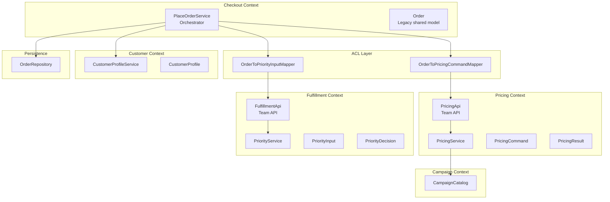
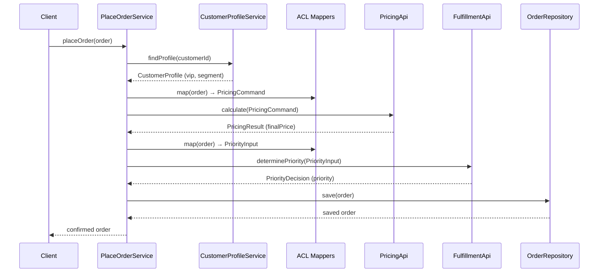
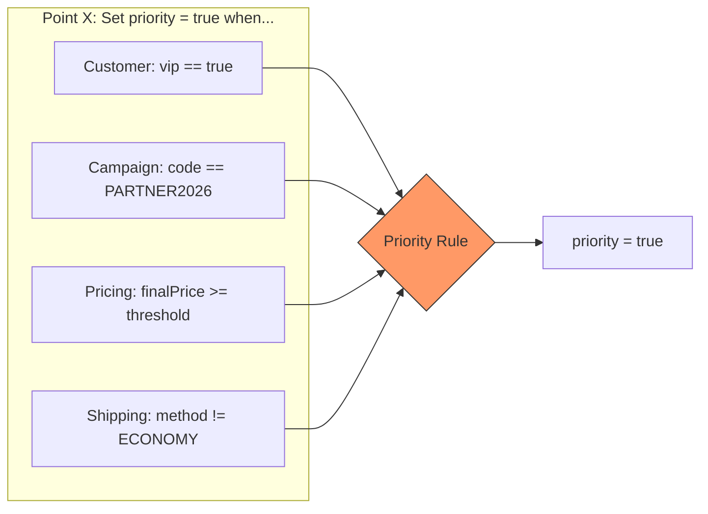

# Legacy Demo — Cost of Change, Conway's Law & Team APIs

> **A 40-minute live-coding demo** showing that "legacy" is not about old technology —
> it's about **cost of change**. We use Conway's Law, Team Topologies,
> characterization tests, seams, Team APIs, and Anti-Corruption Layers
> to make change cheaper — **without jumping to microservices**.

**Author:** [Łukasz Pięta](https://www.lukaszpieta.tech/)
📬 **Contact:** <https://www.lukaszpieta.tech/>

---

## Talk Framing

| Concept | Key Idea |
|---|---|
| **Legacy = cost of change** | Legacy isn't old tech. It's code where every "small" change is expensive, risky, and slow. |
| **Conway's Law** | System structure mirrors communication structure. When teams change but code doesn't, coupling grows. |
| **Team Topologies** | Stream-aligned teams need clear ownership boundaries. Shared code creates coordination tax. |
| **Cognitive Load** | One team can't own everything. Shared models increase the mental surface area per change. |
| **Team APIs** | Explicit contracts (`PricingApi`, `FulfillmentApi`) reduce coordination cost between teams. |
| **ACL (Anti-Corruption Layer)** | Translates between the legacy shared model and context-specific models. Contains the legacy influence. |
| **Bounded Context ≠ Microservice** | We draw boundaries in **code** first (contracts, models, packages). Deployment topology is a separate decision. |

---

## Domain Overview — "Place Order"

An e-commerce company evolved from one team into four:

- **Checkout Team** — orchestrates the order flow
- **Pricing & Campaigns Team** — calculates prices, applies discounts
- **Fulfillment Team** — decides priority routing and warehouse assignment
- **Customer Team** — manages customer profiles, VIP status, segments

But the **system boundaries did not evolve accordingly**:

- One shared `Order` model (a "super-model" mixing all concerns)
- One orchestration service `PlaceOrderService` (a "shared flow" embedding all rules)

### The result: rising cost of change

- "Small" changes cut across 4 areas (customer, campaign, pricing, shipping)
- Coordination tax increases with every new rule
- Regression risk grows
- Deployments become unpredictable

---

## Diagrams

### C4-Lite Component View



### Sequence Diagram — Happy Path



### Point X — Why One "Small" Rule Crosses 4 Areas



---

## Git History — Live Demo Navigation

### List commits
```bash
git log --oneline --decorate --graph --all
```

### Checkout a step
```bash
git checkout <tag-name>
# e.g. git checkout 00-baseline-legacy-order-flow
```

### Tags
```
00-baseline-legacy-order-flow
01-new-business-rule
02-characterization-tests
03-extract-priority-seam
04-team-api-pricing
05-separate-context-input-models
06-add-acl-mappers
07-next-change-becomes-cheaper
```

---

### Commit-by-Commit Guide

#### `00-baseline-legacy-order-flow`
**Files to open:** `PlaceOrderService.kt`, `Order.kt`
- **Problem:** All responsibilities live inline in one service, one shared model
- **Change:** Baseline — plausible legacy code that grew under delivery pressure
- **Why it matters:** This is the starting cost-of-change baseline

#### `01-new-business-rule`
**Files to open:** `PlaceOrderService.kt` (diff)
- **Problem:** Adding Point X requires touching data from 4 different areas
- **Change:** Inline `if` checking VIP + campaign + price + shipping → priority
- **Why it matters:** Shows the coordination cost — one "small" rule spans all concerns

#### `02-characterization-tests`
**Files to open:** `PlaceOrderCharacterizationTest.kt`
- **Problem:** No safety net for refactoring
- **Change:** Kotest characterization tests pinning current behavior (4 cases)
- **Why it matters:** Safety first — tests describe what the system does, not what it should do

#### `03-extract-priority-seam`
**Files to open:** `FulfillmentApi.kt`, `PriorityService.kt`, `PriorityServiceTest.kt`
- **Problem:** Priority logic is embedded in the orchestrator
- **Change:** Extract `FulfillmentApi` with `PriorityInput → PriorityDecision` contract
- **Why it matters:** First seam — Fulfillment team can now own this logic independently

#### `04-team-api-pricing`
**Files to open:** `PricingApi.kt`, `PricingService.kt`, `PricingServiceTest.kt`
- **Problem:** Pricing logic is embedded in the orchestrator
- **Change:** Extract `PricingApi` with `PricingCommand → PricingResult` contract
- **Why it matters:** Second seam — Pricing team gets a clear API boundary

#### `05-separate-context-input-models`
**Files to open:** `FulfillmentApi.kt`, `PricingApi.kt`
- **Problem:** Context boundaries need explicit, owned input/output models
- **Change:** Add `segment` to `PriorityInput`; add doc comments clarifying ownership
- **Why it matters:** Each context defines its own language — no legacy `Order` leaks in

#### `06-add-acl-mappers`
**Files to open:** `OrderToPricingCommandMapper.kt`, `OrderToPriorityInputMapper.kt`, `PlaceOrderService.kt`
- **Problem:** The orchestrator still manually maps Order fields to context inputs
- **Change:** ACL mappers (`OrderToPricingCommandMapper`, `OrderToPriorityInputMapper`)
- **Why it matters:** Legacy `Order` influence is contained — contexts are shielded

#### `07-next-change-becomes-cheaper`
**Files to open:** `PriorityService.kt`, `PriorityServiceTest.kt` (check `git diff`)
- **Problem:** Prove the architecture pays off
- **Change:** GOLD segment gets lower priority threshold — **only fulfillment files change**
- **Why it matters:** `PlaceOrderService` is untouched. Cost of change dropped. QED.

---

## Build & Test

```bash
./gradlew build
./gradlew test
```

Requires **JDK 21+**. No Spring, no HTTP, no DB — everything is in-memory and deterministic.

---

## Key Takeaway

> **Bounded context ≠ microservice.**
> Draw boundaries in **code** first — contracts, models, packages.
> Deployment topology is a separate, later decision.

The goal is not a distributed system. The goal is **reducing the cost of change**
by aligning code boundaries with team responsibilities.

---

## Demo Checklist (for the speaker)

1. [ ] Terminal open with `git log --oneline --decorate --graph --all`
2. [ ] IDE open on `PlaceOrderService.kt`
3. [ ] Walk through commits 00→01 — show the "small but expensive" change
4. [ ] Show characterization tests (02) — safety net
5. [ ] Extract seams (03, 04) — show Team APIs
6. [ ] Show input models (05) and ACL (06) — boundaries in code
7. [ ] The payoff: `git diff 06-add-acl-mappers 07-next-change-becomes-cheaper`
8. [ ] Key message: "Which files changed? Only fulfillment. Cost of change: **down**."
9. [ ] Close with: bounded context ≠ microservice; boundaries in code first

---

## Tech Stack

| Tool | Version |
|---|---|
| Kotlin | 1.9.25 |
| JDK | 21 |
| Gradle | 8.10.2 (Kotlin DSL) |
| Testing | Kotest 5.9.1 (runner-junit5 + assertions) |

---

**Author & Contact:** [https://www.lukaszpieta.tech/](https://www.lukaszpieta.tech/)

